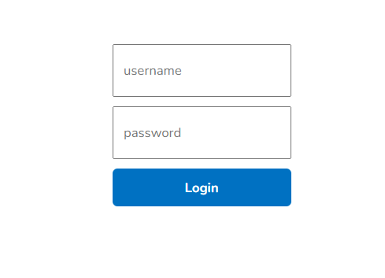
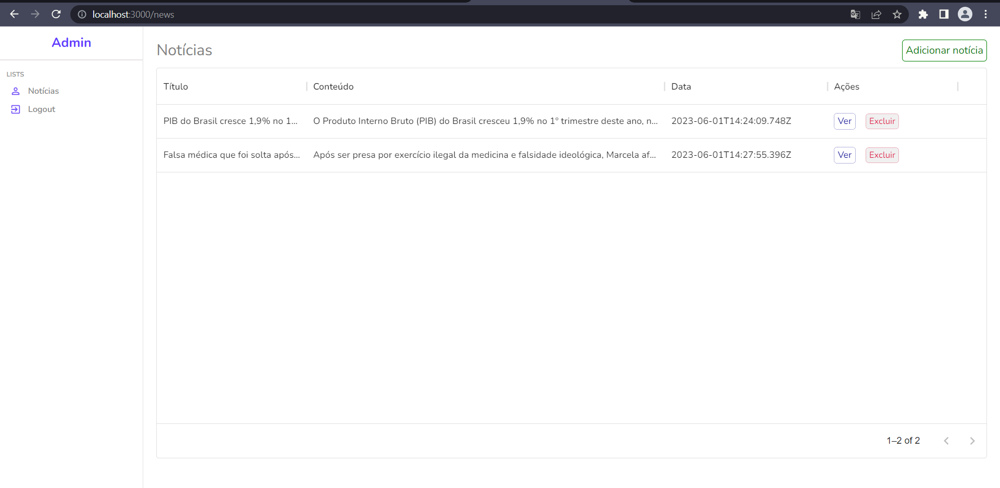
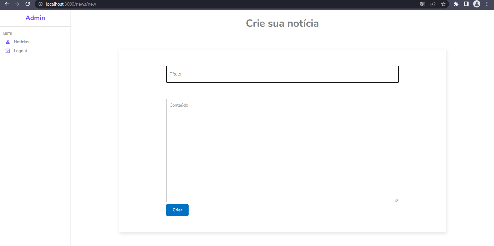
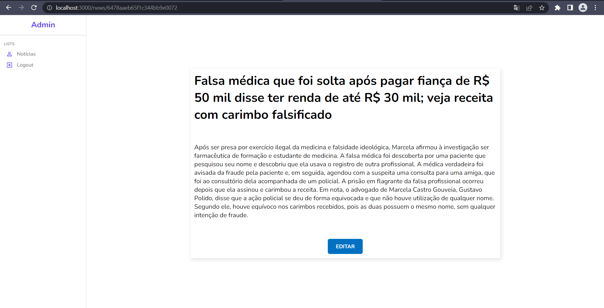
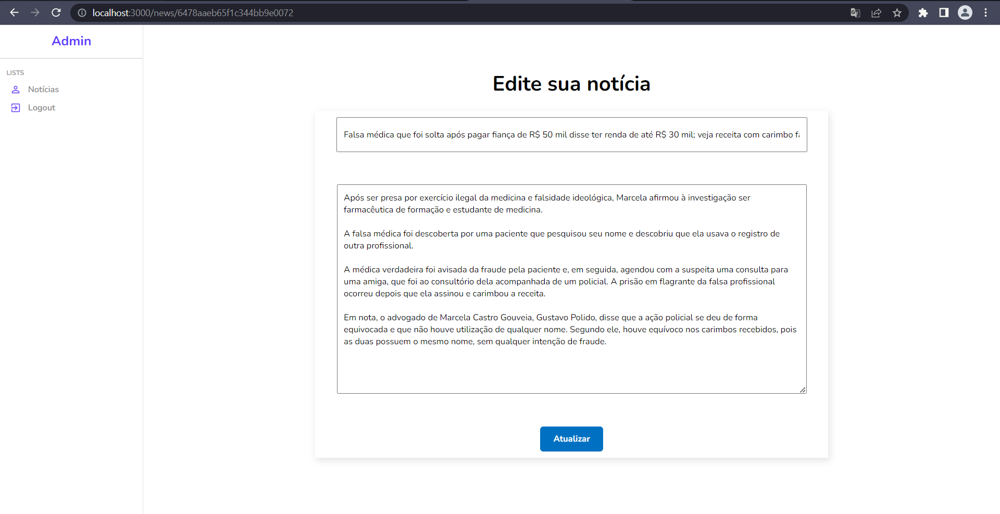

# Sobre:
Criando um sistema CRUD de notícias.
---

## Tela de login do admin:
<p align="center" >
    
</p>

---

## Tela de listagem das notícias:
<p align="center" >
    
</p>

---
## Tela de criação de notícia:
<p align="center" >
    

</p>

---
## Tela de listagem de uma notícia específica:
<p align="center" >
    

</p>

---
## Tela de edição de uma notícia:
<p align="center" >
    
</p>


# Tecnologias:
- [Express](https://expressjs.com/pt-br/)
- [MongoDB](https://www.mongodb.com/pt-br)
- [ReactJS](https://pt-br.reactjs.org/)
- [SCSS](https://sass-lang.com/)
- [Axios](https://axios-http.com/ptbr/docs/intro)


# Como baixar:

# Backend
```

    $ git clone https://github.com/Giovani2912/crud-news.git

    $ cd api

# Caso esteja utilizando o npm

    $ npm install

    $ npm start

# Caso esteja utilizando o yarn

    $ yarn 

    $ yarn start


```
# Frontend
```

    $ git clone https://github.com/Giovani2912/crud-news.git

    $ cd admin

# Caso esteja utilizando o npm

    $ npm install

    $ npm start

# Caso esteja utilizando o yarn

    $ yarn 

    $ yarn start
    